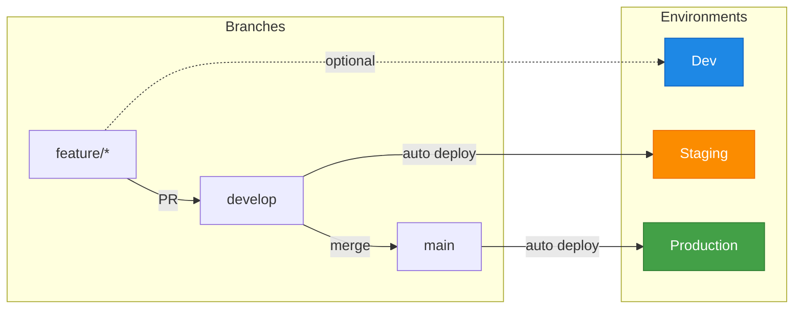

# Hugo GitOps Pipeline

A complete, reusable CI/CD pipeline for Hugo sites with GitOps deployment.



## Quick Start

**1. Add `project.json` to your Hugo repo:**

```json
{
  "environments": {
    "staging": {
      "when": "^refs/heads/develop$",
      "baseurl": "https://staging.example.com",
      "gitops": { "repository": "myorg/gitops", "file": "apps/mysite/values-staging.yaml" }
    },
    "production": {
      "when": "^refs/heads/main$",
      "baseurl": "https://www.example.com",
      "gitops": { "repository": "myorg/gitops", "file": "apps/mysite/values-prod.yaml" }
    }
  }
}
```

**2. Add workflow `.github/workflows/ci-cd.yml`:**

```yaml
name: CI/CD
on:
  push:
    branches: [main, develop]

jobs:
  pipeline:
    uses: slauger/hugo-gitops-pipeline/.github/workflows/hugo-gitops.yml@v1
    with:
      registry: registry.example.com
      image_name: my-hugo-site
    secrets: inherit
```

**3. Configure secrets and push.**

## Documentation

| | |
|---|---|
| [Getting Started](https://slauger.github.io/hugo-gitops-pipeline/getting-started/) | Step-by-step setup guide |
| [Configuration](https://slauger.github.io/hugo-gitops-pipeline/configuration/) | All `project.json` options |
| [Environments](https://slauger.github.io/hugo-gitops-pipeline/environments/) | Multi-environment setup |
| [Architecture](https://slauger.github.io/hugo-gitops-pipeline/architecture/) | GDPR-compliant reference architecture |

## License

MIT
