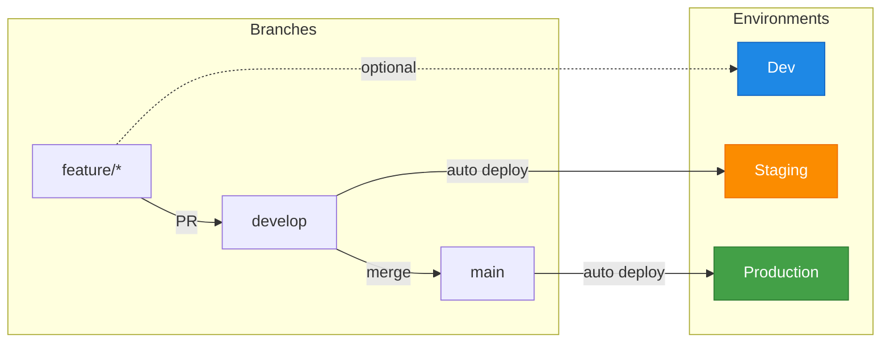

# Hugo GitOps Pipeline

A complete, reusable CI/CD pipeline for Hugo sites with GitOps deployment to Kubernetes. Designed for **GDPR-compliant hosting** entirely within the EU - no Cloudflare, no Google Fonts, no external CDNs.

> **New to this project?** Check out the [Getting Started Guide](https://slauger.github.io/hugo-gitops-pipeline/getting-started/) and the [Reference Architecture](https://slauger.github.io/hugo-gitops-pipeline/architecture/).

## Features

- 🇪🇺 **GDPR-Compliant** - Self-hosted on Hetzner Cloud (Germany), no data leaves the EU
- 🔄 **GitOps Ready** - Automated deployment via ArgoCD with [gitops-image-replacer](https://github.com/slauger/gitops-image-replacer)
- 🌍 **Multi-Environment** - Support for dev, staging, QA, production with branch-based deployment
- 📦 **Reusable Workflow** - Single `workflow_call` for all your Hugo sites
- 🛠️ **Flexible Build Steps** - Customize build/lint/test phases or add your own
- 🐳 **Container Images** - Builder (Node.js + Hugo), Runtime (hardened nginx), Cleanup (registry GC)
- 🔒 **Security** - Pinned image digests, non-root containers, security headers
- 🏷️ **Semantic Versioning** - Automated releases with [semantic-release](https://github.com/semantic-release/semantic-release)

### Branch to Environment Mapping

Each branch automatically deploys to its corresponding environment:



## Quick Start

**1. Add `project.json` to your Hugo repo:**

```json
{
  "environments": {
    "staging": {
      "when": "^refs/heads/develop$",
      "environment": "staging",
      "gitops": { "repository": "myorg/gitops", "file": "apps/mysite/values-staging.yaml" }
    },
    "production": {
      "when": "^refs/heads/main$",
      "environment": "production",
      "gitops": { "repository": "myorg/gitops", "file": "apps/mysite/values-prod.yaml" }
    }
  }
}
```

The `environment` field maps to Hugo's native [Configuration Directory](https://gohugo.io/getting-started/configuration/#configuration-directory) - use it to show environment banners, change colors, or adjust settings per environment.

**2. Add workflow `.github/workflows/ci-cd.yml`:**

```yaml
name: CI/CD
on:
  push:
    branches: [main, develop]
  workflow_dispatch:

jobs:
  pipeline:
    uses: slauger/hugo-gitops-pipeline/.github/workflows/hugo-gitops.yml@v1
    with:
      registry: registry.example.com
      image_name: my-hugo-site
    secrets: inherit
```

**3. Configure secrets and push.**

## Documentation

| Guide | Description |
|-------|-------------|
| [Getting Started](https://slauger.github.io/hugo-gitops-pipeline/getting-started/) | Step-by-step setup guide |
| [Configuration](https://slauger.github.io/hugo-gitops-pipeline/configuration/) | All `project.json` options |
| [Build Steps](https://slauger.github.io/hugo-gitops-pipeline/build-steps/) | Customize build phases |
| [Environments](https://slauger.github.io/hugo-gitops-pipeline/environments/) | Multi-environment setup |
| [Architecture](https://slauger.github.io/hugo-gitops-pipeline/architecture/) | GDPR-compliant reference architecture |

## License

MIT
