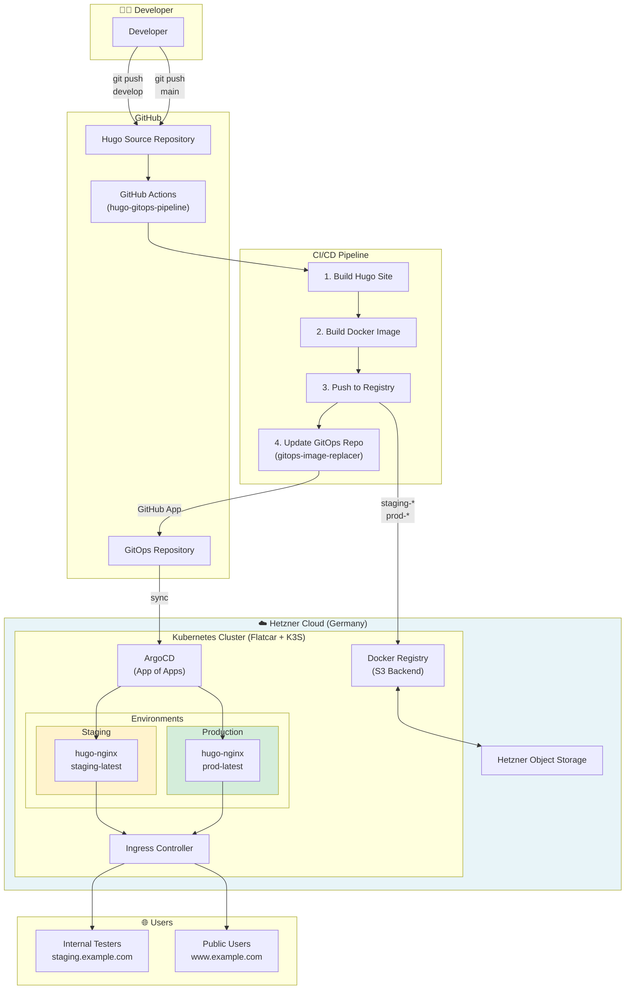
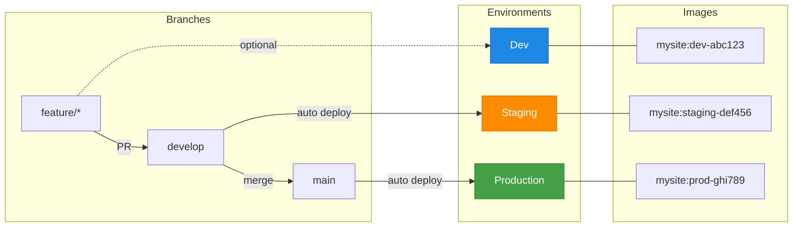

# Reference Architecture

A complete, GDPR-compliant Hugo hosting stack on Hetzner Cloud - fully self-hosted in Germany, no external CDNs.

## Architecture Overview



## Multi-Environment Workflow



## Configuration (project.json)

The `project.json` in your Hugo repository defines which branch deploys to which environment:

```json
{
  "environments": {
    "dev": {
      "when": "^refs/heads/feature/.*$",
      "baseurl": "https://dev.example.com",
      "gitops": {
        "repository": "myorg/gitops",
        "file": "apps/mysite/values-dev.yaml"
      }
    },
    "staging": {
      "when": "^refs/heads/develop$",
      "baseurl": "https://staging.example.com",
      "gitops": {
        "repository": "myorg/gitops",
        "file": "apps/mysite/values-staging.yaml"
      }
    },
    "production": {
      "when": "^refs/heads/main$",
      "baseurl": "https://www.example.com",
      "gitops": {
        "repository": "myorg/gitops",
        "file": "apps/mysite/values-prod.yaml"
      }
    }
  }
}
```

## Components

### Infrastructure Layer

| Component | Repository | Description |
|-----------|------------|-------------|
| **Flatcar Linux + K3S** | [slauger/flatcar-hcloud](https://github.com/slauger/flatcar-hcloud) | Immutable OS with lightweight Kubernetes on Hetzner Cloud |
| **Container Registry** | [slauger/helm-charts/hcloud-registry](https://github.com/slauger/helm-charts/tree/main/charts/hcloud-registry) | Docker Registry with Hetzner S3 backend for image storage |

### GitOps Layer

| Component | Description |
|-----------|-------------|
| **ArgoCD** | Continuous Deployment with App-of-Apps pattern |
| **GitOps Repository** | Single source of truth for all Kubernetes manifests |
| **gitops-image-replacer** | [slauger/gitops-image-replacer](https://github.com/slauger/gitops-image-replacer) - Updates image references in GitOps repo |

### CI/CD Layer

| Component | Repository | Description |
|-----------|------------|-------------|
| **Hugo Pipeline** | [slauger/hugo-gitops-pipeline](https://github.com/slauger/hugo-gitops-pipeline) | Reusable GitHub Actions workflow for Hugo sites |
| **Builder Image** | `ghcr.io/slauger/hugo-gitops-pipeline/builder` | Node.js + Hugo extended |
| **Runtime Image** | `ghcr.io/slauger/hugo-gitops-pipeline/runtime` | Hardened nginx |
| **Cleanup Image** | `ghcr.io/slauger/hugo-gitops-pipeline/cleanup` | Registry garbage collection |

### Application Layer

| Component | Repository | Description |
|-----------|------------|-------------|
| **Hugo nginx Helm Chart** | [slauger/helm-charts/hugo-nginx](https://github.com/slauger/helm-charts/tree/main/charts/hugo-nginx) | Helm chart for deploying Hugo sites |

## Data Flow

```
1. Developer pushes code to GitHub
                ↓
2. GitHub Actions triggers hugo-gitops-pipeline
                ↓
3. Pipeline builds Hugo site and Docker image
                ↓
4. Image pushed to self-hosted registry (Hetzner S3)
                ↓
5. gitops-image-replacer updates GitOps repository
                ↓
6. ArgoCD detects change and syncs
                ↓
7. New image deployed to Kubernetes
                ↓
8. Users see updated website
```

## GDPR Compliance

This architecture is designed for **full GDPR compliance**:

| Requirement | Implementation |
|-------------|----------------|
| **Data Location** | All data hosted in Germany (Hetzner Falkenstein/Nuremberg) |
| **No External CDNs** | All assets served from own infrastructure |
| **No Third-Party Tracking** | No Google Analytics, no external fonts |
| **Data Processing** | No personal data leaves German jurisdiction |
| **Subprocessors** | Only Hetzner (German company, German DCs) |

### What this means:

- **No Cloudflare** - Direct hosting, no US-based proxy
- **No Google Fonts** - Self-hosted fonts only
- **No External JS** - All JavaScript bundled locally
- **No Cookie Banners needed** - No tracking = no consent required (for the hosting itself)

## Cost Estimation

### Small Setup (Personal Blog / Small Business)

| Resource | Specification | Monthly Cost |
|----------|---------------|--------------|
| Hetzner CX22 | 2 vCPU, 4GB RAM, 40GB SSD | ~€4.50 |
| Hetzner Object Storage | 50GB S3 (Registry) | ~€2.50 |
| Domain | .de domain | ~€1.00 |
| **Total** | | **~€8/month** |

*Suitable for: 1-5 sites, <10k visitors/month*

### Medium Setup (Agency / Multiple Sites)

| Resource | Specification | Monthly Cost |
|----------|---------------|--------------|
| Hetzner CX32 | 4 vCPU, 8GB RAM, 80GB SSD | ~€8.50 |
| Hetzner CX22 (Worker) | 2 vCPU, 4GB RAM | ~€4.50 |
| Hetzner Object Storage | 250GB S3 | ~€6.00 |
| Load Balancer | LB11 | ~€6.00 |
| **Total** | | **~€25/month** |

*Suitable for: 10-20 sites, <100k visitors/month*

### Large Setup (Enterprise / High Traffic)

| Resource | Specification | Monthly Cost |
|----------|---------------|--------------|
| Hetzner CX42 (Control) | 8 vCPU, 16GB RAM | ~€16.50 |
| Hetzner CX32 (Workers x3) | 4 vCPU, 8GB RAM each | ~€25.50 |
| Hetzner Object Storage | 1TB S3 | ~€12.00 |
| Load Balancer | LB11 | ~€6.00 |
| Floating IPs | 2x IPv4 | ~€8.00 |
| **Total** | | **~€68/month** |

*Suitable for: 50+ sites, <1M visitors/month*

### Cost Comparison

| Provider | Small | Medium | Large |
|----------|-------|--------|-------|
| **This Setup (Hetzner)** | €8 | €25 | €68 |
| Netlify | €19+ | €99+ | €299+ |
| Vercel | €20+ | €100+ | Custom |
| AWS (EKS + S3 + CloudFront) | €80+ | €200+ | €500+ |

*Note: Prices are estimates and may vary. Hetzner prices as of 2024.*

## Quick Start

### Prerequisites

1. Hetzner Cloud account
2. GitHub account
3. Domain with DNS management

### Step 1: Deploy Infrastructure

```bash
# Clone flatcar-hcloud
git clone https://github.com/slauger/flatcar-hcloud
cd flatcar-hcloud

# Configure and deploy (see repo README)
terraform init
terraform apply
```

### Step 2: Setup ArgoCD

```bash
# Install ArgoCD
kubectl create namespace argocd
kubectl apply -n argocd -f https://raw.githubusercontent.com/argoproj/argo-cd/stable/manifests/install.yaml

# Setup App of Apps (your GitOps repo)
kubectl apply -f apps/root-app.yaml
```

### Step 3: Deploy Registry

```bash
# Add Helm repo
helm repo add slauger https://slauger.github.io/helm-charts

# Install registry with S3 backend
helm install registry slauger/hcloud-registry \
  --set s3.accessKey=xxx \
  --set s3.secretKey=xxx \
  --set s3.bucket=my-registry
```

### Step 4: Setup Hugo Site

1. Create `project.json` in your Hugo repo (see [Configuration](../README.md#configuration))
2. Create `.github/workflows/ci-cd.yml` calling this pipeline
3. Configure secrets (registry credentials, GitOps app)
4. Push and watch it deploy!

## Security Considerations

- **Network Policies**: Restrict pod-to-pod communication
- **Pod Security Standards**: Enforce restricted policies
- **Image Signing**: Consider sigstore/cosign for image verification
- **Secrets Management**: Use sealed-secrets or external-secrets
- **Registry Authentication**: Always use authentication, never expose publicly
- **TLS Everywhere**: Let's Encrypt via cert-manager

## Monitoring (Optional)

For production setups, consider adding:

- **Prometheus + Grafana**: Metrics and dashboards
- **Loki**: Log aggregation
- **Uptime Kuma**: Simple uptime monitoring (self-hosted)

All available as Helm charts, all self-hosted, all GDPR-compliant.
