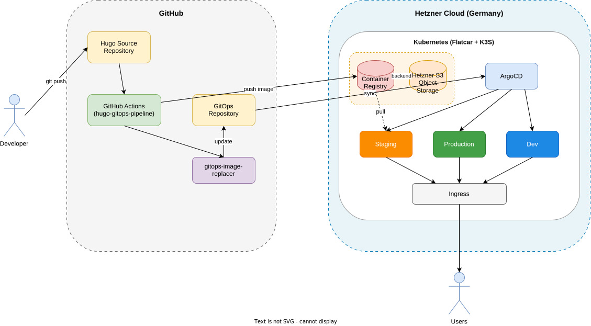

# Reference Architecture

A complete, GDPR-compliant Hugo hosting stack on Hetzner Cloud - fully self-hosted in Germany, no external CDNs.

## Architecture Overview



<!-- TODO: Create with draw.io and export as SVG -->

## Components

### Infrastructure

| Component | Repository | Description |
|-----------|------------|-------------|
| Flatcar Linux + K3S | [slauger/flatcar-hcloud](https://github.com/slauger/flatcar-hcloud) | Immutable OS with lightweight Kubernetes |
| Container Registry | [slauger/helm-charts/hcloud-registry](https://github.com/slauger/helm-charts/tree/main/charts/hcloud-registry) | Docker Registry with Hetzner S3 backend |

### GitOps

| Component | Description |
|-----------|-------------|
| ArgoCD | Continuous Deployment with App-of-Apps pattern |
| GitOps Repository | Single source of truth for Kubernetes manifests |
| gitops-image-replacer | [slauger/gitops-image-replacer](https://github.com/slauger/gitops-image-replacer) |

### CI/CD

| Component | Description |
|-----------|-------------|
| hugo-gitops-pipeline | This project - reusable GitHub Actions workflow |
| Builder Image | Node.js + Hugo extended |
| Runtime Image | Hardened nginx |
| Cleanup Image | Registry garbage collection |

### Application

| Component | Repository |
|-----------|------------|
| Hugo nginx Helm Chart | [slauger/helm-charts/hugo-nginx](https://github.com/slauger/helm-charts/tree/main/charts/hugo-nginx) |

## Data Flow

```
1. Developer pushes to GitHub
          ↓
2. GitHub Actions runs pipeline
          ↓
3. Build Hugo site + Docker image
          ↓
4. Push to self-hosted registry
          ↓
5. gitops-image-replacer updates GitOps repo
          ↓
6. ArgoCD syncs to cluster
          ↓
7. Users see updated site
```

## GDPR Compliance

| Requirement | Implementation |
|-------------|----------------|
| Data Location | Germany (Hetzner Falkenstein/Nuremberg) |
| No External CDNs | All assets from own infrastructure |
| No Third-Party Tracking | No Google Analytics, no external fonts |
| Subprocessors | Only Hetzner (German company) |

**What this means:**

- No Cloudflare (no US-based proxy)
- No Google Fonts (self-hosted only)
- No external JavaScript
- No cookie banners needed for hosting

## Quick Start

### 1. Deploy Infrastructure

```bash
git clone https://github.com/slauger/flatcar-hcloud
cd flatcar-hcloud

# Build Flatcar image with Packer
export HCLOUD_TOKEN="your-token"
packer init .
packer build .

# Deploy with Terraform
cd terraform
terraform init
terraform apply
```

### 2. Setup ArgoCD

```bash
kubectl create namespace argocd
kubectl apply -n argocd -f https://raw.githubusercontent.com/argoproj/argo-cd/stable/manifests/install.yaml
```

### 3. Deploy Registry

```bash
helm repo add slauger https://slauger.github.io/helm-charts
helm install registry slauger/hcloud-registry \
  --set s3.accessKey=xxx \
  --set s3.secretKey=xxx
```

### 4. Setup Hugo Site

See [Getting Started](getting-started.md).

## Security

- Network Policies for pod isolation
- Pod Security Standards (restricted)
- Registry authentication required
- TLS everywhere (cert-manager + Let's Encrypt)
- Consider image signing (sigstore/cosign)

## See Also

- [Cost Estimation](costs.md)
- [Environments](environments.md)
- [Related Projects](related-projects.md)
