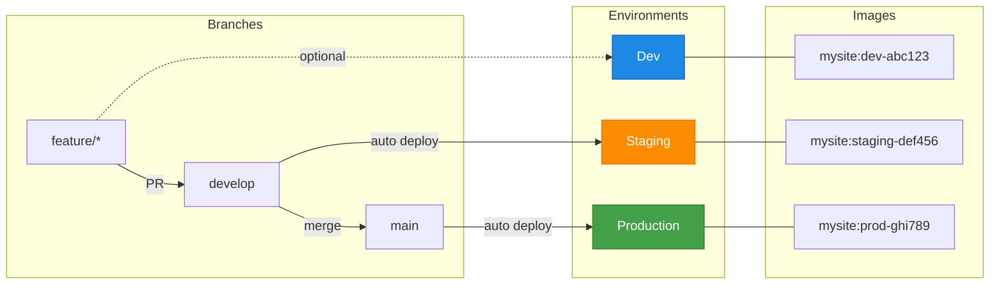

# Hugo GitOps Pipeline

A complete, reusable CI/CD pipeline for Hugo sites with GitOps deployment.

## Features

- **Zero-config builds** - Just add a `project.json` and go
- **Multi-environment support** - dev, staging, qa, production - as many as you need
- **GitOps deployment** - Automatic image updates via [gitops-image-replacer](https://github.com/slauger/gitops-image-replacer)
- **Automated updates** - Renovate keeps Hugo, nginx, and all dependencies current
- **Semantic versioning** - Automatic releases with semantic-release
- **GDPR-compliant** - Self-hosted in Germany, no external CDNs

## How it works

## Quick Start

1. Create a [`project.json`](configuration.md) in your Hugo repository
2. Add the [workflow](getting-started.md#create-workflow) to `.github/workflows/`
3. Configure [secrets](getting-started.md#configure-secrets) and push

That's it! Your Hugo site will automatically build and deploy on every push.

## Next Steps

- [Getting Started](getting-started.md) - Step-by-step setup guide
- [Configuration](configuration.md) - All `project.json` options
- [Architecture](architecture.md) - Reference architecture for self-hosted setup
